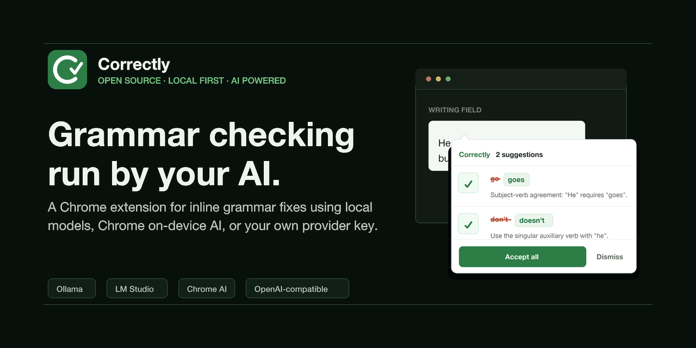

# Correctly

A minimalist browser extension that checks grammar, spelling, and punctuation using AI — either your own API key or Chrome's built-in Gemini Nano.





## Features

- Works on any text input, textarea, or contentEditable element
- Inline correction tooltip with accept/dismiss per suggestion
- Supports OpenAI, OpenAI Compatible (Groq, OpenRouter, etc.), Ollama, LM Studio, and Chrome's built-in Gemini Nano ("Chrome Free AI")
- Currently supports English — more languages coming
- Custom model selection - use any model your provider supports
- Chrome Free AI runs entirely on-device — no API key needed, no data leaves your machine
- Configurable log verbosity for debugging
- Respects `spellcheck`, `disabled`, `readonly`, ARIA attributes, and `data-correctly` opt-out

## Install

1. Download target package from [latest release](https://github.com/iamaamir/Correctly/releases):
   - `correctly-chrome.zip` for Chrome/Chromium
   - `correctly-firefox.xpi` for Firefox
   
2. For Chrome/Chromium:
   - Open `chrome://extensions`
   - Enable **Developer mode**
   - Click **Load unpacked** and select unzipped folder

3. For Firefox :
   - Drop the `correctly-firefox.xpi` in firefox
  
## Using Providers:
  
   - **Ollama**: see [Using Ollama](#using-ollama) below
   - **LM Studio**: see [Using LM Studio](#using-lm-studio) below
   - **OpenAI Compatible**: see [Using OpenAI Compatible](#using-openai-compatible) below
  
  
## Build locally

- `npm run build:release:chrome` -> `correctly-chrome.zip`
- `npm run build:release:firefox` -> `correctly-firefox.xpi`
- `npm run build:release` builds both


## Using Ollama

Correctly supports [Ollama](https://ollama.com) for local grammar checking. No API key is needed for local instances — if you use Ollama with authentication, enter your key as usual.

1. Pull a model: `ollama pull llama3`
2. Install and load the extension. The `Origin: chrome-extension://...` header is handled automatically.
3. If you get a 403 error, your Ollama version's CORS check is blocking the extension origin. Fix:
   ```
   # Kill the Ollama app, then:
   OLLAMA_ORIGINS=* ollama serve
   ```
4. In the extension popup, select **Ollama**, choose a model, and save. An API key is only needed if your Ollama instance requires authentication.

   
## Using LM Studio

Correctly supports [LM Studio](https://lmstudio.ai) for local grammar checking. No API key is needed.

1. Open LM Studio, load a model, and start the local inference server (default port 1234)
2. Make sure **Local CORS** is turned off in LM Studio's settings
3. In the extension popup, select **LM Studio**, choose a model, and save

## Using OpenAI Compatible

Correctly supports any service that offers an OpenAI-compatible API (e.g., [Groq](https://groq.com), [OpenRouter](https://openrouter.ai), [DeepSeek](https://deepseek.com)). You provide the base URL and API key.

1. In the extension popup, select **OpenAI Compatible**
2. Enter the full base URL (e.g., `https://api.groq.com/openai/v1`)
3. Enter your API key
4. Select a model, click **Save** — the extension verifies the connection and ready to serve

## Want to add a new Provider?

- **OpenAI-compatible API** (e.g., Ollama, LM Studio): extend `AbstractOpenAICompatibleProvider`
  — `_doCorrectGrammar()` and response parsing are already implemented. Just provide
  static metadata and set `this.endpoint` in the constructor.
- **Generic OpenAI-compatible** (any service with a base URL + API key): no new class needed
  — use `GenericOpenAIProvider` which is already registered. Users configure the base URL
  and API key in the popup.
- **Other providers**: extend `AbstractProvider` directly and implement
  `_doCorrectGrammar(text)` and all required static metadata.

Then add the class to `PROVIDER_CLASSES` in `provider-registry.js`.


## Privacy and Security

- **Your API key is stored locally** in browser extension local storage on your device. It is never sent to any server other than your chosen AI provider.
- **Chrome Free AI runs entirely on-device** — text is processed by Chrome's built-in Gemini Nano model. No data is ever sent over the network.
- **For other providers** (e.g., OpenAI), text you type is sent to the chosen AI provider for grammar checking. Avoid typing sensitive information in fields where the extension is active, or use `data-correctly="false"` to opt out specific elements.
- Password fields, credit card inputs, and other sensitive field types are automatically excluded.


## Project Structure

```
correctly/
├── index.html             # Static landing page for the project
├── landing.css            # Landing page styles
├── landing.js             # Landing page enhancement script
├── manifest.base.json
├── manifest.chrome.patch.json
├── manifest.firefox.patch.json
├── background/
│   ├── service-worker.js      # Message routing, badge, provider orchestration
│   └── handlers/
│       ├── badge.js           # Extension badge state management
│       ├── grammar.js         # Grammar check pipeline, token usage tracking
│       ├── settings.js        # Settings verification and status
│       └── chrome-free-ai.js  # Chrome Free AI status and download
├── content/
│   ├── writing-session.js     # Content-side typing lifecycle and stale check handling
│   ├── content.js             # Input detection, tooltip, correction adapters
│   └── content.css            # Tooltip and indicator styles
├── popup/
│   ├── popup.html             # Settings UI
│   ├── popup.js               # Settings logic
│   └── popup.css              # Popup styles
├── providers/
│   ├── abstract-provider.js  # Abstract provider contract
│   ├── abstract-openai-compatible-provider.js  # Shared logic for OpenAI-compatible APIs
│   ├── openai-provider.js     # OpenAI implementation
│   ├── chrome-free-ai-provider.js  # Chrome's built-in Gemini Nano
│   ├── ollama-provider.js          # Ollama (local LLMs)
│   ├── lmstudio-provider.js        # LM Studio (local LLMs)
│   ├── generic-openai-provider.js  # Generic OpenAI-compatible (Groq, OpenRouter, etc.)
│   └── provider-registry.js   # Provider lookup and creation
└── lib/
    ├── cache.js               # Unified TTL cache (models, availability)
    ├── config.js              # Shared configuration
    ├── logger.js              # Tagged, leveled console logger
    └── settings.js            # Settings persistence and caching
```


## License

