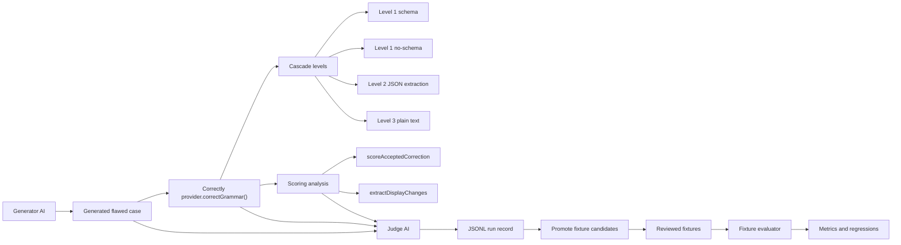
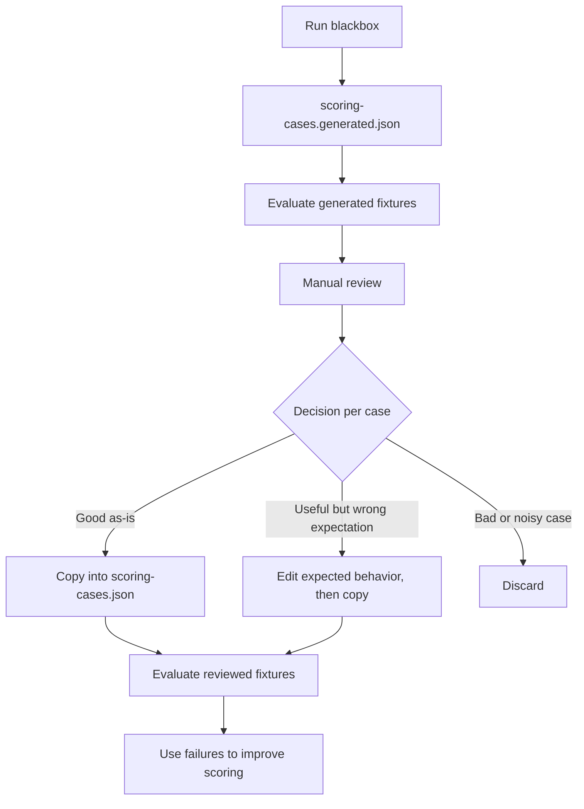
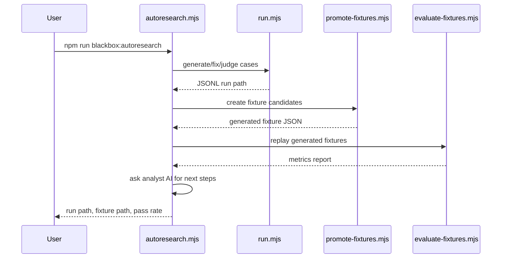
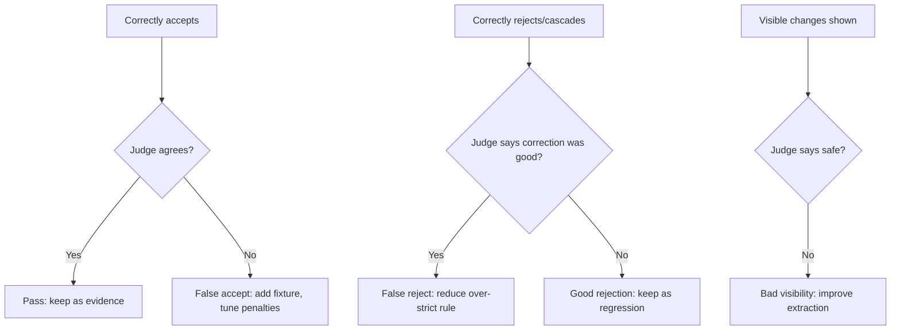

# Correctly Blackbox

Blackbox is a local AI-in-the-loop research harness for improving Correctly's scoring system. It does not use the browser extension UI. It runs the core provider, cascade, scoring, display-suggestion, and fixture-evaluation code directly from Node.

The goal is to create a repeatable evidence loop:

```txt
generate flawed text
→ run Correctly
→ judge the result
→ save interesting cases
→ promote reviewed fixtures
→ replay fixtures against scoring code
→ use the report to improve scoring safely
```

It is inspired by autoresearch-style loops, but it intentionally does not auto-edit production scoring code. It automates discovery, judging, promotion drafts, and regression evaluation. Code changes should still pass the fixture gate.

## Architecture



## What Each Component Does

```txt
blackbox/src/run.mjs
  Main research loop. Generates cases, runs Correctly, judges output, writes JSONL.

blackbox/src/autoresearch.mjs
  Orchestrates run → promote → evaluate.

blackbox/src/promote-fixtures.mjs
  Converts interesting JSONL records into candidate scoring fixtures.

blackbox/src/evaluate-fixtures.mjs
  Replays reviewed fixtures against current scoring code and reports pass/fail metrics.

blackbox/src/analyze-results.mjs
  Uses an analyst AI model to inspect run records and fixture evaluation results, then suggests next engineering steps.

blackbox/src/openai-compatible-client.mjs
  Tiny OpenAI-compatible client for generator and judge models.

blackbox/src/chrome-stub.mjs
  Minimal chrome.storage/runtime stub so extension providers can run in Node.

blackbox/src/prompts.mjs
  Generator and judge prompts.

blackbox/src/json.mjs
  Robust JSON extraction from raw/fenced/prose model output.

blackbox/src/fixtures.mjs
  Converts run records into fixture candidates.
```

## Requirements

- Node 20+.
- A local OpenAI-compatible model server.
- At least one model loaded in Ollama or LM Studio.

Supported local options:

```txt
Ollama
  Chat endpoint: http://localhost:11434/v1/chat/completions
  Base URL for config: http://localhost:11434/v1
  Correctly provider id: ollama

LM Studio
  Chat endpoint: http://localhost:1234/v1/chat/completions
  Base URL for config: http://localhost:1234/v1
  Correctly provider id: lmstudio
```

## Quick Start

1. Copy the config:

```bash
cp blackbox/config.example.json blackbox/config.local.json
```

2. Edit `blackbox/config.local.json` for your local server and model.

3. Run one small loop:

```bash
npm run blackbox -- --config blackbox/config.local.json --cases 3
```

4. Run the full autoresearch pipeline:

```bash
npm run blackbox:autoresearch -- --config blackbox/config.local.json --cases 25
```

5. Evaluate reviewed fixtures:

```bash
npm run blackbox:evaluate -- tests/fixtures/scoring-cases.json --fail-on-regression
```

## Configuration

The config has three model roles:

```json
{
  "generator": {},
  "fixer": {},
  "judge": {},
  "analyst": {}
}
```

### Generator

The generator creates flawed text. It uses the OpenAI-compatible client directly.

```json
"generator": {
  "baseUrl": "http://localhost:11434/v1",
  "apiKey": "ollama",
  "model": "llama3",
  "temperature": 0.8
}
```

Higher temperature gives more diverse cases. Lower temperature gives more repetitive cases.

### Fixer

The fixer is the Correctly system under test. It goes through the same provider/cascade/scoring path used by the extension.

```json
"fixer": {
  "providerId": "ollama",
  "apiKey": "",
  "model": "llama3",
  "baseUrl": ""
}
```

Provider IDs are the same IDs used by Correctly:

```txt
ollama
lmstudio
openai-compatible
openai
```

For local work, prefer `ollama` or `lmstudio`.

### Judge

The judge evaluates whether Correctly behaved well.

```json
"judge": {
  "baseUrl": "http://localhost:11434/v1",
  "apiKey": "ollama",
  "model": "llama3",
  "temperature": 0.1
}
```

Use the strongest available model for judge if possible. The generator can be noisy; the judge should be stricter.

### Analyst

The analyst is optional. If omitted, Blackbox uses the `judge` config. The analyst reads the JSONL run plus fixture evaluation report and suggests next engineering steps.

```json
"analyst": {
  "baseUrl": "http://localhost:1234/v1",
  "apiKey": "lm-studio",
  "model": "google/gemma-3-12b",
  "temperature": 0.1
}
```

Analyst output is advisory. It should say things like:

```txt
bad display change → extractDisplayChanges too permissive
good correction rejected → scoreAcceptedCorrection too strict
fallback/cache issue → provider cascade/cache policy
noisy label → fixture_quality issue
```

## Ollama Setup

1. Start Ollama:

```bash
ollama serve
```

2. Pull a model:

```bash
ollama pull llama3
```

3. Use this config shape:

```json
{
  "runName": "ollama-scoring-research",
  "caseCount": 10,
  "outputDir": "blackbox/runs",
  "seed": "grammar edge cases for email and chat text",
  "generator": {
    "baseUrl": "http://localhost:11434/v1",
    "apiKey": "ollama",
    "model": "llama3",
    "temperature": 0.8
  },
  "fixer": {
    "providerId": "ollama",
    "apiKey": "",
    "model": "llama3",
    "baseUrl": ""
  },
  "judge": {
    "baseUrl": "http://localhost:11434/v1",
    "apiKey": "ollama",
    "model": "llama3",
    "temperature": 0.1
  }
}
```

## LM Studio Setup

1. Open LM Studio.
2. Load a chat model.
3. Start the local server.
4. Use OpenAI-compatible server mode.

Use this config shape:

```json
{
  "runName": "lmstudio-scoring-research",
  "caseCount": 10,
  "outputDir": "blackbox/runs",
  "seed": "grammar edge cases for email and chat text",
  "generator": {
    "baseUrl": "http://localhost:1234/v1",
    "apiKey": "lm-studio",
    "model": "local-model",
    "temperature": 0.8
  },
  "fixer": {
    "providerId": "lmstudio",
    "apiKey": "",
    "model": "local-model",
    "baseUrl": ""
  },
  "judge": {
    "baseUrl": "http://localhost:1234/v1",
    "apiKey": "lm-studio",
    "model": "local-model",
    "temperature": 0.1
  }
}
```

If LM Studio exposes a real model ID, replace `local-model` with that ID.

## Commands

### Run Discovery

```bash
npm run blackbox -- --config blackbox/config.local.json --cases 25
```

Equivalent direct command:

```bash
node blackbox/src/run.mjs --config blackbox/config.local.json --cases 25
```

Output:

```txt
blackbox/runs/<timestamp>-<runName>.jsonl
blackbox/runs/latest.txt
```

### Promote Fixture Candidates

```bash
npm run blackbox:promote -- blackbox/runs/<run>.jsonl --out tests/fixtures/scoring-cases.generated.json
```

If no run file is passed, the promoter reads `blackbox/runs/latest.txt`.

```bash
npm run blackbox:promote -- --out tests/fixtures/scoring-cases.generated.json
```

Promotion is intentionally a draft step. Review the generated file before moving cases into `tests/fixtures/scoring-cases.json`.

### After `scoring-cases.generated.json` Exists

The generated fixture file is not the trusted regression suite. It is raw evidence from a blackbox run.

```txt
tests/fixtures/scoring-cases.generated.json
  Raw candidate fixtures from AI judge output.
  Review before trusting.

tests/fixtures/scoring-cases.json
  Reviewed fixtures.
  This is the scoring regression gate.
```

Use this workflow after every blackbox run:



Step by step:

1. Evaluate generated candidates:

```bash
npm run blackbox:evaluate -- tests/fixtures/scoring-cases.generated.json
```

2. Open the generated file:

```txt
tests/fixtures/scoring-cases.generated.json
```

3. For each case, choose one outcome:

```txt
promote as-is
promote with edited expectations
discard
```

4. Copy reviewed cases into:

```txt
tests/fixtures/scoring-cases.json
```

5. Evaluate the reviewed corpus:

```bash
npm run blackbox:evaluate -- tests/fixtures/scoring-cases.json --fail-on-regression
```

6. Only then use failures to change scoring code.

Generated expectations can encode current bad behavior. For example, if a generated fixture expects this as a visible change:

```json
{ "original": "its", "replacement": "John" }
```

do not promote that expectation as-is. Either discard the case or edit it so the expected behavior reflects the desired scoring policy, such as hiding the bad change or lowering acceptance.

### Evaluate Fixtures

```bash
npm run blackbox:evaluate -- tests/fixtures/scoring-cases.json
```

Write a report:

```bash
npm run blackbox:evaluate -- tests/fixtures/scoring-cases.json --out blackbox/runs/fixture-evaluation.json
```

Fail on regression:

```bash
npm run blackbox:evaluate -- tests/fixtures/scoring-cases.json --fail-on-regression
```

### Analyze Results With AI

After a run and fixture evaluation, ask an analyst model for next steps:

```bash
npm run blackbox:analyze -- \
  --config blackbox/config.local.json \
  --run blackbox/runs/<run>.jsonl \
  --evaluation blackbox/runs/latest-evaluation.json \
  --out blackbox/runs/latest-analysis.json \
  --markdown blackbox/runs/latest-analysis.md
```

If `--run` is omitted, it uses `blackbox/runs/latest.txt`.

The analyst produces:

```txt
blackbox/runs/latest-analysis.json
blackbox/runs/latest-analysis.md
```

Expected recommendation shape:

```json
{
  "priority": "P1",
  "area": "extractDisplayChanges",
  "title": "Hide destructive visible changes",
  "evidenceCaseIds": ["0019"],
  "problem": "A visible suggestion deletes a meaningful clause.",
  "suggestedChange": "Hide empty replacements for word spans unless explicitly safe.",
  "suggestedTests": ["Add fixture expecting the deletion change to be hidden."]
}
```

### Full Autoresearch

```bash
npm run blackbox:autoresearch -- --config blackbox/config.local.json --cases 25
```

Custom outputs:

```bash
npm run blackbox:autoresearch -- \
  --config blackbox/config.local.json \
  --cases 100 \
  --fixtures tests/fixtures/scoring-cases.generated.json \
  --report blackbox/runs/latest-evaluation.json \
  --analysis blackbox/runs/latest-analysis.json \
  --markdown blackbox/runs/latest-analysis.md
```

Autoresearch does:



## Output Schemas

### JSONL Run Record

Each line in `blackbox/runs/*.jsonl` looks like:

```json
{
  "id": "0001-1780000000000",
  "startedAt": "2026-05-31T12:00:00.000Z",
  "provider": {
    "id": "ollama",
    "model": "llama3"
  },
  "generated": {
    "original": "i didnt went there yesterday",
    "intendedMeaning": "The writer did not go there yesterday.",
    "errorTags": ["capitalization", "tense"],
    "notes": "Simple tense and capitalization case."
  },
  "correctlyResult": {
    "corrected": "I didn't go there yesterday.",
    "changes": [],
    "confidence": 55,
    "cascadeLevel": 3
  },
  "scoring": {
    "accepted": true,
    "acceptanceScore": 55,
    "displayChanges": [],
    "hiddenChanges": [],
    "cascadeLevel": 3
  },
  "judge": {
    "verdict": "pass",
    "risk": "none",
    "shouldAccept": true,
    "meaningPreserved": true,
    "grammarImproved": true,
    "visibleSuggestionsSafe": true,
    "reason": "Grammar improved and meaning stayed intact.",
    "fixtureWorthy": false
  },
  "error": null
}
```

### Fixture Shape

Reviewed fixtures live in:

```txt
tests/fixtures/scoring-cases.json
```

Shape:

```json
{
  "id": "standalone-i-hidden-punctuation",
  "original": "so i didnt had any time tolarend",
  "level": 1,
  "rawResponse": {
    "corrected": "So I didn't have any time to learn.",
    "changes": [],
    "confidence": 10
  },
  "expected": {
    "accept": true,
    "corrected": "So I didn't have any time to learn.",
    "displayChanges": [{ "original": "i", "replacement": "I" }],
    "hiddenChangeCount": 1,
    "minAcceptanceScore": 60
  },
  "notes": "Why this fixture matters."
}
```

Supported expectation fields:

```txt
accept
corrected
displayChanges
hiddenChangeCount
minAcceptanceScore
maxAcceptanceScore
```

## How This Improves Scoring

Blackbox helps by finding disagreements:



Useful failures become fixtures. Fixtures become a regression gate. Scoring changes should improve the aggregate fixture report without breaking important edge cases.

## Recommended Workflow

1. Run discovery:

```bash
npm run blackbox -- --config blackbox/config.local.json --cases 100
```

2. Promote candidates:

```bash
npm run blackbox:promote -- --out tests/fixtures/scoring-cases.generated.json
```

3. Review `tests/fixtures/scoring-cases.generated.json`.

4. Move good cases into `tests/fixtures/scoring-cases.json`.

5. Evaluate:

```bash
npm run blackbox:evaluate -- tests/fixtures/scoring-cases.json --fail-on-regression
```

6. Change scoring code.

7. Re-run:

```bash
npm test
npm run blackbox:evaluate -- tests/fixtures/scoring-cases.json --fail-on-regression
```

## What Is Fully Automated

Automated:

```txt
case generation
Correctly fixing
scoring analysis
AI judging
JSONL persistence
candidate fixture generation
fixture replay
metrics report
AI analyst recommendations
regression failure exit code
```

Not automated by default:

```txt
editing production scoring rules
committing generated fixtures
trusting AI judge labels without review
```

That boundary is intentional. The harness can run unattended, but production scoring changes should still be reviewed against metrics.

## Troubleshooting

### `Local model HTTP 404`

The base URL is probably wrong.

Use:

```txt
Ollama:    http://localhost:11434/v1
LM Studio: http://localhost:1234/v1
```

Do not include `/chat/completions` in `baseUrl`.

### `fetch failed` or `ECONNREFUSED`

The local server is not running.

For Ollama:

```bash
ollama serve
```

For LM Studio, start the local server in the app.

### `Generator returned invalid case`

The generator model did not follow JSON. Try:

```txt
- lower generator temperature
- stronger generator model
- fewer cases while testing
```

### `Judge returned invalid JSON`

The harness marks the case `interesting`. Try a stronger judge model or lower judge temperature.

### Correctly provider fails with schema errors

That is expected for some local models. Correctly should cascade through no-schema, Level 2, and Level 3. Those events are useful research signals.

### Fixture evaluation fails

Read the failure line:

```txt
FAIL fixture-id: accept expected true, got false
```

Either:

```txt
- scoring regressed
- fixture expectation is wrong
- the fixture is too brittle and needs a broader score range
```

## Safety

Do not run Blackbox on private user text unless you explicitly intend to log that text.

Blackbox writes raw originals, model corrections, judge comments, and scoring output to JSONL. Treat `blackbox/runs/` as potentially sensitive.

Recommended:

```txt
- keep generated runs local
- review before sharing
- do not commit large raw run files unless intentionally curated
- commit reviewed fixtures, not raw research dumps
```
